<h1 align="center">NewsBytes 🌍</h1>

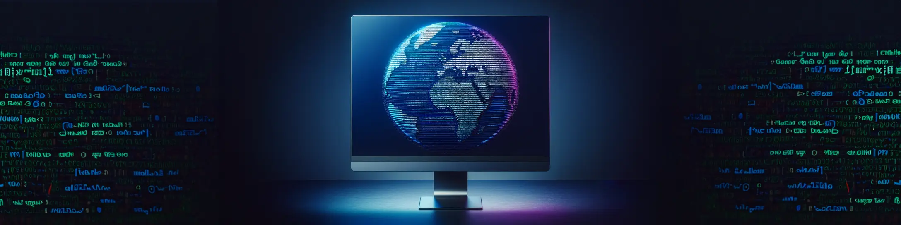

<h3 align="center"><a href="https://news-bytes-f757f042ac64.herokuapp.com/">➡️ View the live project here ⬅️</a></h3>

 

## Introduction

NewsBytes is a sleek CLI-based application, crafted in Python and hosted on Heroku, designed to keep users informed with global news. Mirroring an innovative online news marketplace, it empowers users to explore and "buy" articles aggregated from diverse sources across the web. Upon creating an account, users can recharge it with funds, and the platform conveniently supports five major global currencies. These funds can be converted into credits, which are then redeemable for news articles within the app.

Users can choose from a diverse array of news categories, from business to technology. Plus, special discounts are available depending on the day of the week when users log in!

<h3 align="center">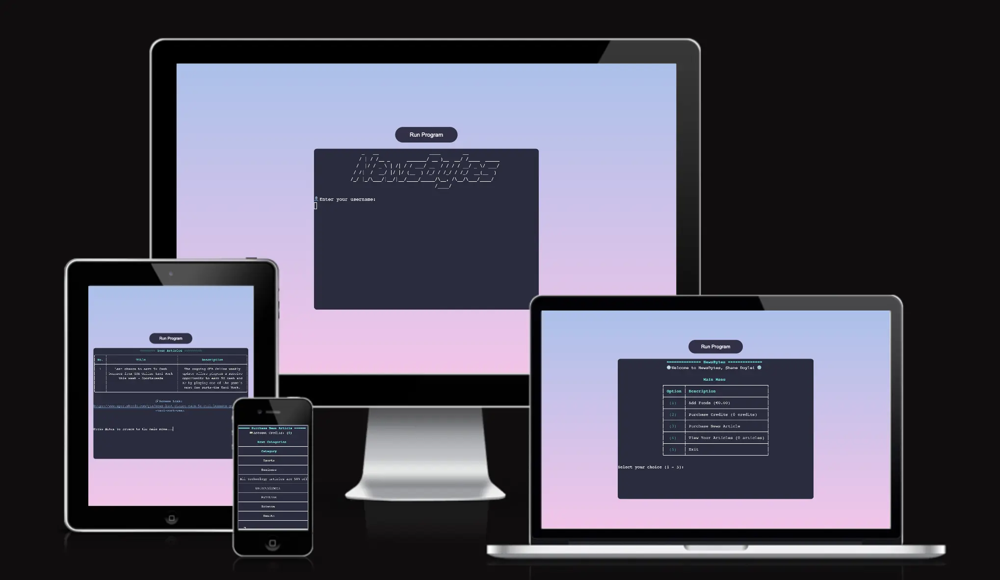</h3>

## Table of Contents

- [User Experience (UX)](#user-experience-ux)
  - [User Stories](#user-stories)
- [Design](#design)
  - [Colour Scheme](#colour-scheme)
  - [Logo](#logo)
  - [Wireframe](#wireframe)
  - [Flowchart](#flowchart)
- [Features](#features)
  - [Existing Features](#existing-features)
  - [Future Implementations](#future-implementations)
- [Technologies](#technologies)
  - [Programming Languages](#programming-languages)
  - [Applications, APIs & Libraries Used](#applications-apis-libraries-used)
- [Deployment & Local Development](#deployment--local-development)
  - [Deployment](#deployment)
  - [Local Development](#local-development)
- [Testing](#testing)
- [Credits](#credits)
  - [Code Used And Tutorials](#code-used-and-tutorials)
  - [Acknowledgments](#acknowledgments)

## User Experience (UX)

The target audience for this app comprises individuals keen on staying informed about global news and current world events. These could include Professionals and Academics, students in higher education, or more tech-savvy users who might be comfortable with using terminal-based interfaces. They seek a platform where they can access news articles from diverse sources through a streamlined interface. A key benefit of this terminal-based environment is its minimalistic, distraction-free nature, focusing solely on text. This design ensures users can engage with articles without the clutter of advertisements and other intrusive UI elements, allowing for a more focused reading experience.

- ### User stories

  - #### User Goals

    1. As a user, I want to sign into the application using my unique username for personalized access.

    2. As a user, I wish to purchase app credits in various major currencies, ensuring more international accessibility.

    3. As a user, I want a main menu displaying the available tasks within the app for easy navigation.

    4. As a user, I want to view my account balance, credits, and purchased articles to understand my current status and resources.

    5. As a user, I wish to easily top up my account funds using my preferred currency.

    6. As a user, I want to understand the value of in-store credits in relation to my chosen currency and decide how many credits to add.

    7. As a user, I'm interested in selecting news categories based on my preferences.

    8. As a user, I want to receive notifications about special discounts available on any given day to maximize benefits.

    9. As a user, I want a dedicated space to store and retrieve information on the articles I've purchased, ensuring easy access.

    10. As a user, I want a straightforward option to exit and close the application once I'm done.

## Design

- #### Colour Scheme

  ### 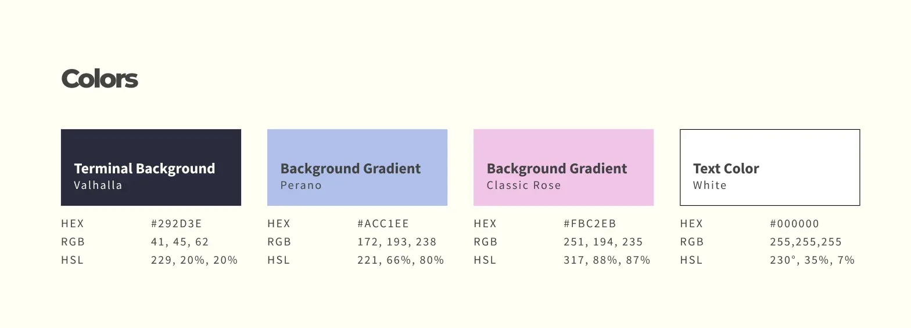

To enhance the reader's comfort and visual enjoyment, I opted for calming pastel hues and smooth gradients. The background was transformed from the stark black of the default terminal style to a gentle purple, maintaining a pleasing contrast with the text. This page background features a harmonious gradient blending blues and purples, complementing the terminal interface and crafting a more unified and soothing visual experience.

- #### Logo

  ### 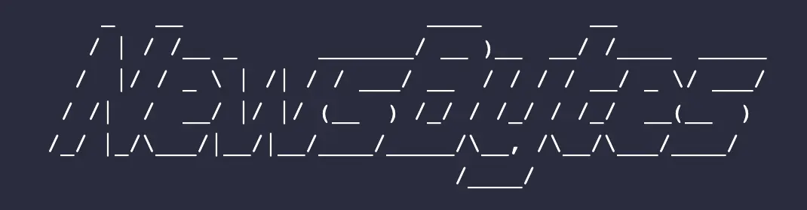

Given the constraints of employing ASCII art in a terminal environment, I chose to utilize the Pyfiglet library. This enables me to prominently display the application's name in a way that is prominantly displayed to the user upon startup. This approach serves as an effective visual welcome splash screen.

- #### Wireframe

### 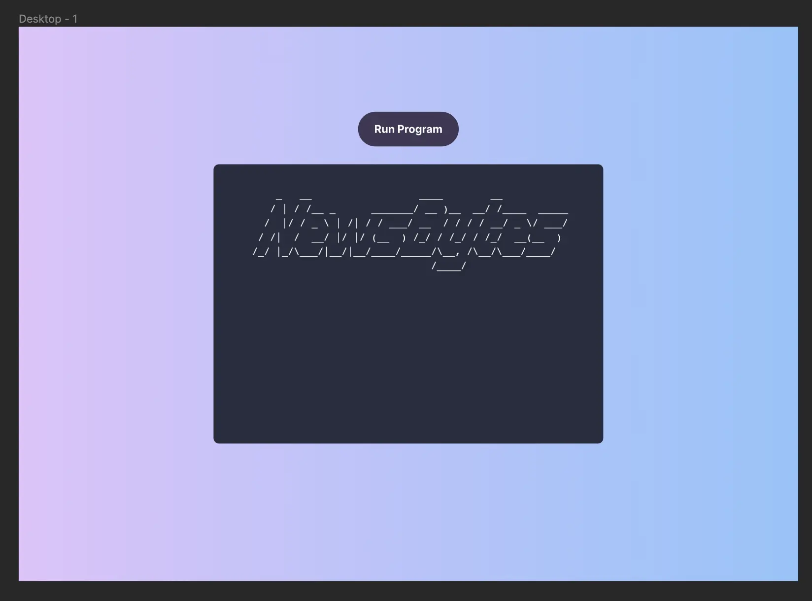

Since I knew I wanted to customize the visuals of the base template, I used Figma to create a visual mockup. Once finished, this would then allow me to dive right into the CSS code to bring it to life on the web.

Wireframe - [Figma Link](https://www.figma.com/file/SpWzvM7lK3Z1u2HKUToDlZ/NewsBytes?type=design&node-id=0-1&mode=design&t=yWOG5SEMr8wFY5IK-0)

- #### Flowchart

### 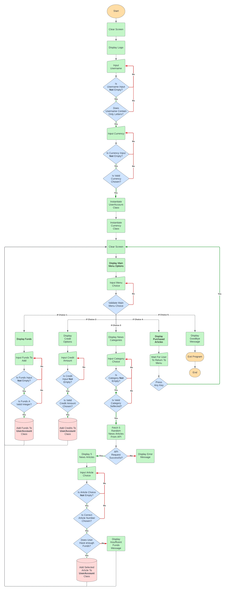

I used LucidChart to plan out the overall flow of logic and structure of the application. This was a great tool, allowing me to visualize at a high level how all of the components would connect together. In particular, it helped me with building my class abstractions as I was able to decide from this what features and functionality I wanted to group together into objects to help with the maintainability and structure of my code moving forward.

## Features

### Existing Features

<h3 align="center">Terminal</h3>

### 

- The Terminal serves as the main interface of the application, allowing users to interact with the Python script by inputting information and navigating the app.

- I enhanced the basic terminal design from the base template for added style, changing the background color, rounding the corners, and centering it on the screen for a more aesthetically pleasing layout and presentation.

- The title is rendered in large, stylish ASCII text using the Pyfiglet library, serving as a welcoming screen for users and signifying that the app is running and ready to receive commands.

 

---

 

<h3 align="center">Run Program Button</h3>

### 

The 'Run Program' button has also been customized from the base template styles to better match the appearance of the terminal. This button allows users to run or restart the application at any point, should they wish to reset.

 

---

 

<h3 align="center">Username Input</h3>

### 

- The application's first interaction with the user is through the Username input prompt. This username is important as it gets associated with the UserAccount object, which is used to maintain a record of the user's session details.

### 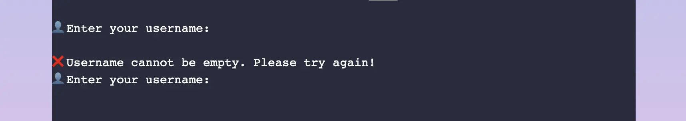

- To ensure meaningful interaction, the system is designed to prompt for re-entry if a user submits an empty response or just whitespace. Users are informed that the username field cannot be left blank, guiding them to provide a valid input.

### 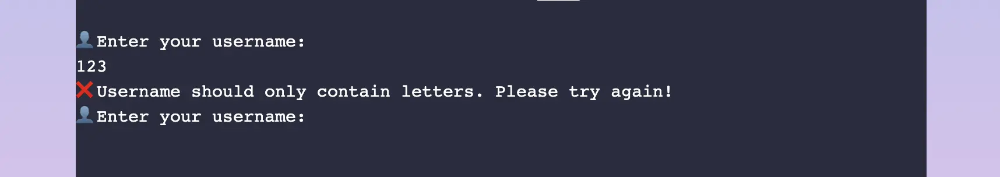

- The application strictly requires that usernames consist only of letters. If a user enters any non-letter characters, like numbers, they are promptly informed of this requirement. The system then informs them to enter a username using only a specified letter-only format.

 

---

 

<h3 align="center">Currency Input</h3>

### 

- The currency input allows users to select from a variety of world currencies, as shown in the input prompt. This currency will be used to calculate the exchange rate, which determines the price of one in-store credit. 1 credit is equivalent to 1 USD, so this is used as the exchange rate to find the value of credits in other selected currencies.

### 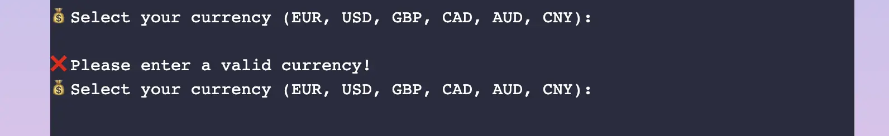

- If the user does not enter a value or does not select from the range of currency codes provided in the prompt message, then the app will re-prompt the user for a correct value before it can proceed to the main menu section.

 

---

 

<h3 align="center">Main Menu Section</h3>

### 

- The main menu serves as the central point of the application. This is where users can perform all tasks associated with the application, from purchasing credits to buying and reading news articles.

- The main menu features a small subhead that welcomes the users based on their given username.

- The application uses the Rich library to style the terminal interface. I am using the Table class in Rich, along with some customized parameters, to generate the table you see here.

- The application uses the Python Rich library to style the terminal interface. I am using the Table class in Rich, along with some customized parameters, to generate the table you see here.

 

---

 

<h3 align="center">Add Funds Section</h3>

### 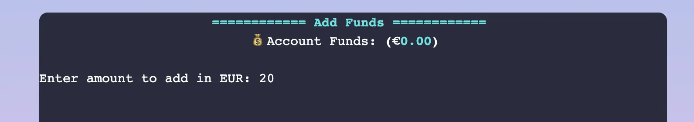

- The add funds section is where users can top up their accounts with their chosen currency.

- The section will show the user's current account funds along with the correct currency symbol as visual feedback.

### 

- If users do not submit any value, they will be prompted again with a corresponding message.

### 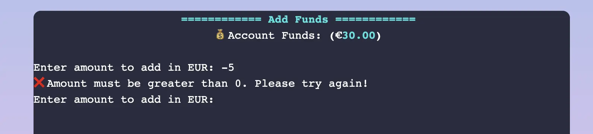

- If users try to submit a negative integer, they will be informed that the amount must be greater than 0.

### 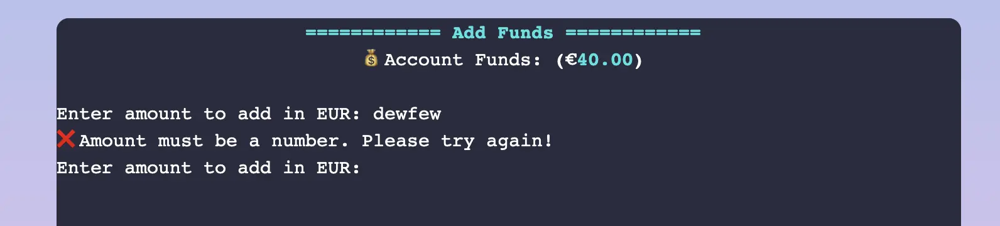

- If users do not input a whole number or try to enter characters, they will be notified that they must enter a number.

### 

- When users enter the correct value, they will be notified with the amount they have added to their account with a message in green. This color styling is applied using the Console object of the imported Rich library.

- Users can now return to the main menu at any time by tapping a key, enhancing interactivity. This improves on my previous implementation where the app automatically returned to the menu after a set time.

 

---

 

<h3 align="center">Purchase Credits Section</h3>

### 

- The purchase credits section allows users to purchase in-store credits that can be redeemed for news articles in the app.

- The table and colors were created with the help of the Rich library and customized to fit the needs of my project.

- The user's account credits are displayed at the top of the screen so the user knows how many credits they have available to spend.

- The cost of each credit package is determined by the price of 1 USD multiplied by the exchange rate of the user's chosen currency. This exchange rate is sourced in real-time from the [ExchangeRate API](https://app.exchangerate-api.com/sign-in)

### 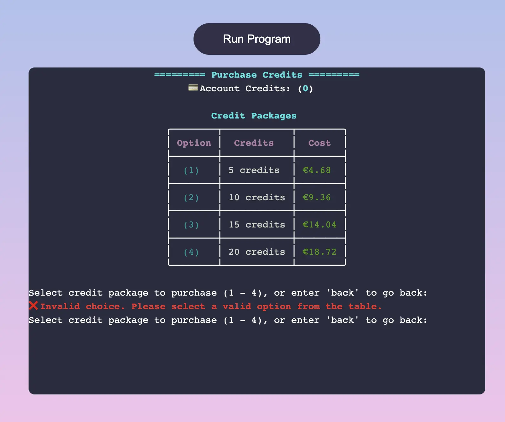

- If a user does not enter a value, they are prompted to enter a valid option from the table.

### 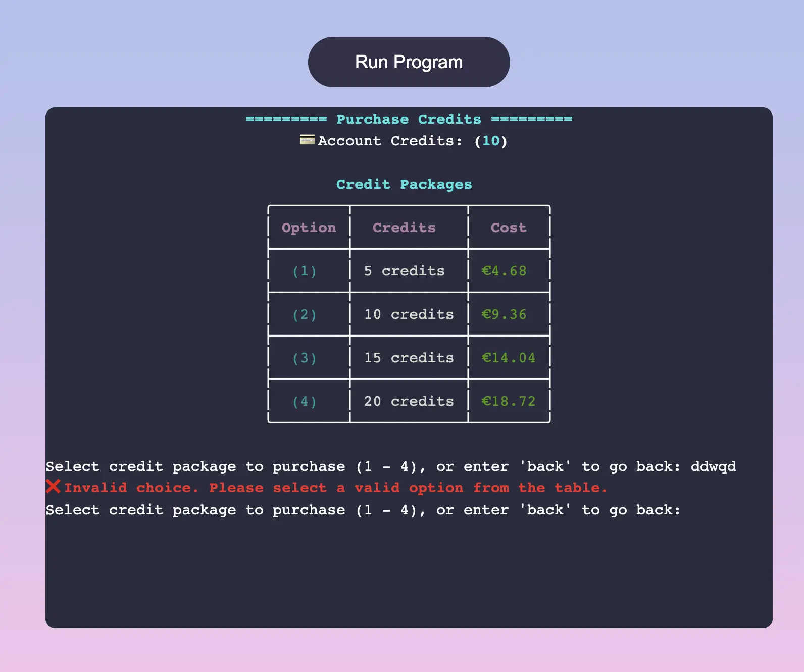

- If the user enters a letter or some other invalid character that does not correspond to an integer in the range (1 - 5), then they are prompted to select a correct value.

### 

- If the user enters a letter or some other invalid character that does not correspond to an integer in the range (1 - 5), then they are prompted to select a correct value.

### 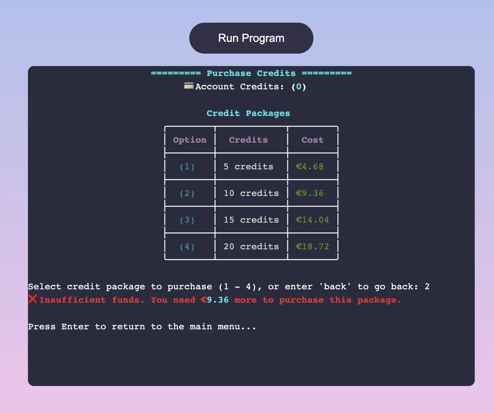

- If the user has fewer funds than required to purchase the selected credit amount, they will be notified that they have insufficient funds along with the necessary amount required to make the purchase. This is done by subtracting the cost from the user's funds to calculate the difference.

### 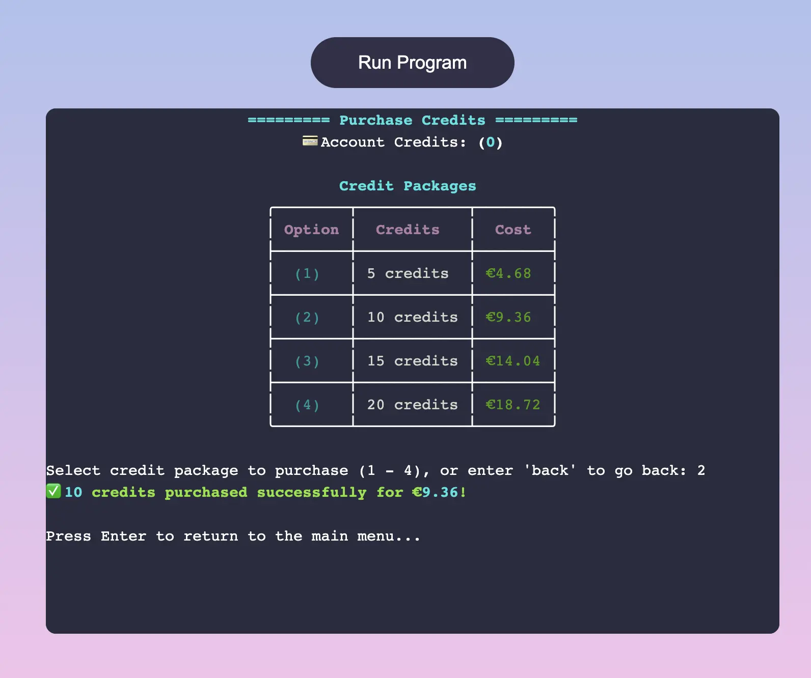

- When the user successfully purchases a credit package they can afford, they are notified of how many credits they have purchased and also how much funds they have spent from their account. The funds are then deducted from their account.

- Users can enter any key in order to successfully transition back to the main menu.

 

---

 

<h3 align="center">Purchase News Articles Section</h3>

### 

- The article purchase section displays a table of available news categories and their respective article costs.

- Each week, one category is featured with a 50% promotional discount.

- User credits are shown at the top, indicating the current spending balance.

### 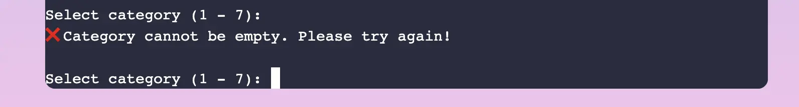

- If a user does not enter a value, they are prompted to enter a valid option from the table.

### 

- If the user enters a letter or some other invalid character that does not correspond to an integer in the range (1 - 7), then they are prompted to select a correct value.

### 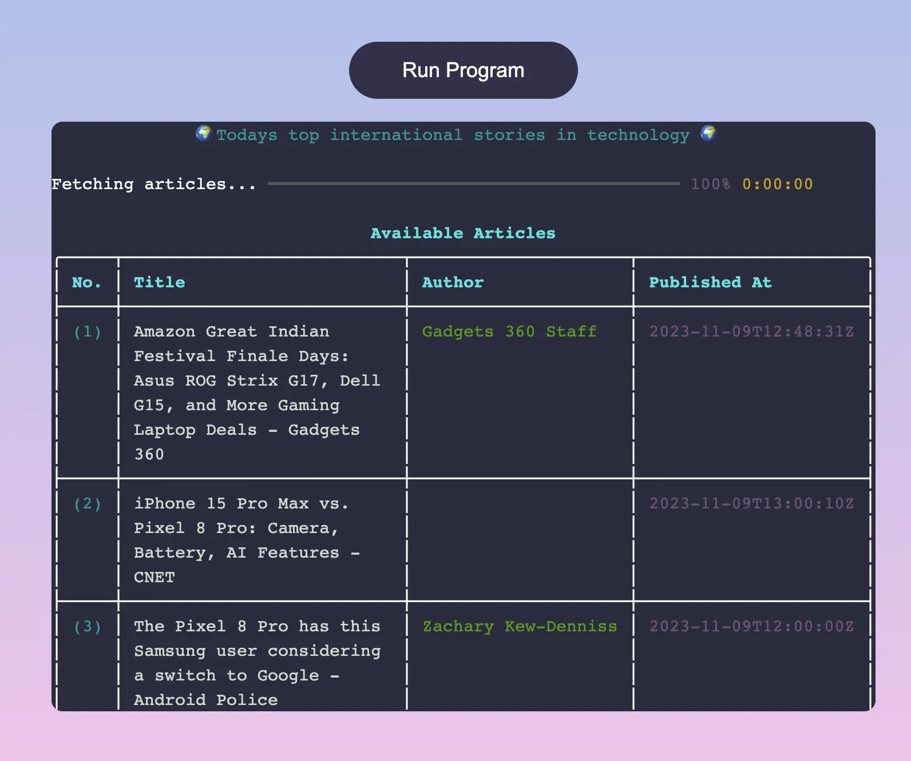

- Upon selecting a valid category, users see a table of five randomly chosen news articles, sourced via API request from [NEWS API](https://newsapi.org/).

- During the API request, the Rich progress bar visually indicates download progress. Each loop iteration updates the progress bar and adds an article to the selected_articles property of the NewsVendor class.

- After retrieving and converting articles from JSON to a Python dictionary, essential properties of each article are extracted and displayed in the appropriate table column.

### 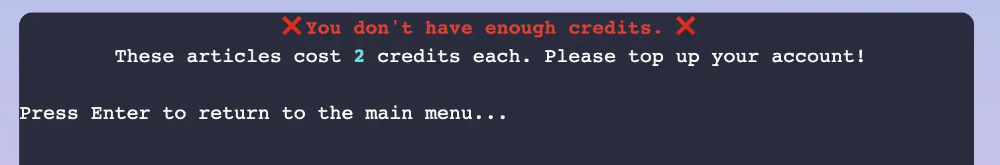

- If a user lacks sufficient credits for a selected article, they are nofified of the article's cost.

- Users can then press any key to return to the main menu, where they have the option to add credits to their account.

 

---

 

<h3 align="center">User Articles Section</h3>

### 

- The user articles page displays purchased articles in a table, showcasing article number, title, and a brief summary.

- Each article in the list includes its corresponding access link, which users can copy and paste into their browser to read the full article on the news website.

### 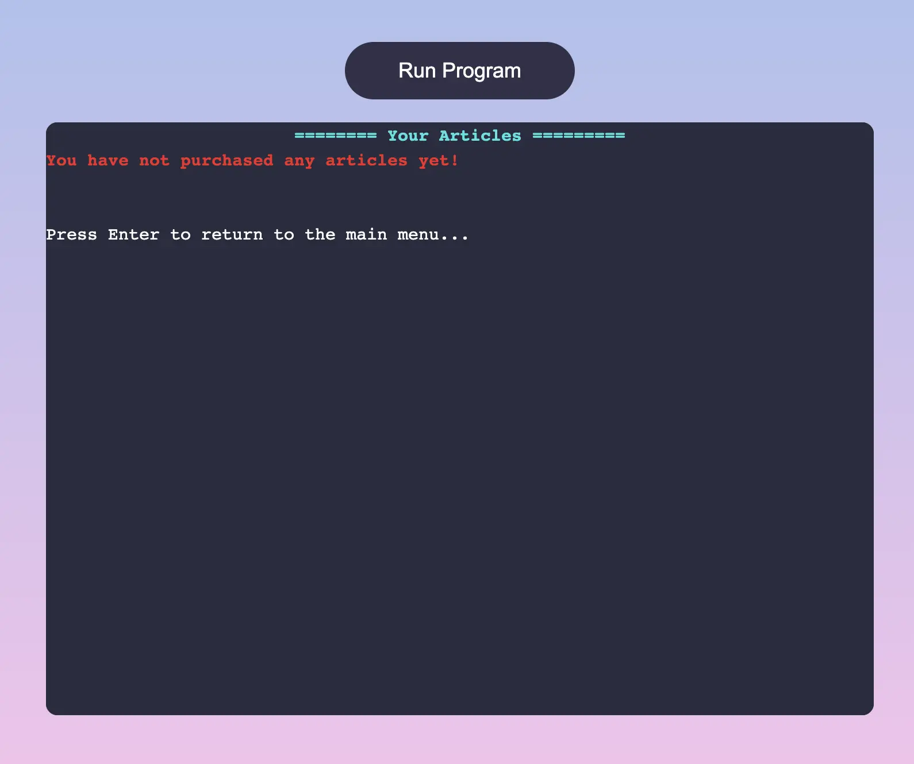

- If a user has no articles upon visiting this section, they are notified of this and offered an option to return to the main menu by pressing any key.

 

---

 

<h3 align="center">Exit Section</h3>

### 

- When the exit option is selected it simply terminates the program and displays a friendly farewell message to the user.

 

---

### Future Implementations

1. **User Account Management**

   - Implement a robust database system to securely store user information, including usernames, balance, and transaction history, ensuring data persistence.

   - Implement basic authentication protocols to safeguard user login and protect account integrity.

    

2. **Access to Purchase History:**

   - Users should be able to access their purchase history to retrieve previously bought articles, ensuring continuity even after the application restarts.

    

3. **News Customization by Location**

   - Introduce the ability for users to customize their news feed by filtering content based on their country or local region.

   - Provide users with the option to tailor their news experience to receive local news based on their location or to opt for global news, all within their categories of interest.

    

4. **Have a loyalty system**

   - Implement a loyalty program where users receive bonus credits or discounts when they recharge their accounts by a certain threshold.

   - Offer a free bonus article to users in proportion to the number of articles they purchase, enhancing user engagement and loyalty.

## Technologies

### Programming Languages

- [HTML5](https://en.wikipedia.org/wiki/HTML5)
- [CSS3](https://en.wikipedia.org/wiki/Cascading_Style_Sheets)
- [JavaScript](https://en.wikipedia.org/wiki/JavaScript)
- [Python](<https://en.wikipedia.org/wiki/Python_(programming_language)>)

### Applications, APIs & Libraries Used

1. [Visual Studio Code](https://code.visualstudio.com/) - I used Visual Studio Code on my local machine as my preferred IDE for coding the HTML, CSS, and JavaScript. It aided in the development process of the project and helped in creating the README file using markdown.

2. [Git](https://git-scm.com/) - I used Git for version control, operating it from the terminal on my local machine. All changes were pushed to my remote repository on GitHub.

3. [GitHub](https://github.com/) - GitHub hosts my project remotely, making the source code accessible to others. I also deploy my site via GitHub Pages.

4. [GitKraken](https://www.gitkraken.com/) - This tool serves as a GUI for managing git history. While I primarily use the terminal for git commands, this GUI aids in visualizing and interactively modifying commit history. It was especially helpful for using interactive rebase to tidy up early commits and maintain a clean main branch.

5. [Figma](https://www.figma.com/) - Figma was used to experiment with colors and create the visual mockup of how I wanted my customized terminal to look.

6. [Shields.io](https://shields.io/) - I utilized this service to integrate badges into the README.

7. [Heroku](https://heroku.com/) - Heroku is a PaaS that is used for the deployment of my website.

8. [Lucidchart](https://www.lucidchart.com/) - Lucidchart was used to create the flowchart diagram. Creating this chart helped me map out the flow of logic in my app and visualize how I would plan out my functions and classes to handle the data.

9. [Pyfiglet](https://pypi.org/project/pyfiglet/#description) - This library was used to help generate the ASCII art text for the application logo.

10. [Rich](https://rich.readthedocs.io/en/stable/index.html) - Rich is a Python library used to add visual flair to my terminal interface. Rich allowed me to generate tables to help layout the menu options, add a progress bar for loading API requests, and also add color within the terminal to enhance readability.

11. [Requests](https://pypi.org/project/requests/) - Requests is a simple Python HTTP library which was used to make API requests.

12. [ExchangeRate API](https://www.exchangerate-api.com/) - ExchangeRate API is a free API that provides the user with 1,500 API requests per month. This allowed me to fetch the currency exchange rate for the user's chosen currency and was used to help calculate the cost of store credits in the application.

13. [News API](https://newsapi.org/) - This is another API used in my application, allowing up to 100 requests per day for free. The API allows you to filter the response by category and language.

 

## Deployment & Local Development

### Deployment

The site is deployed using Heroku.

To deploy the site using Heroku - [Heroku](https://news-bytes-f757f042ac64.herokuapp.com/)

1. Fork or clone this repository.
2. Create a new Heroku app.
3. Choose a region.
4. Set the buildbacks to Python and NodeJS in that order.
5. In Heroku's settings, add a config var of PORT and set the value to 8000.
6. Link the Heroku app to the Github respository.
7. Click on Deploy.

The site has now been deployed. Please note that this process may take a few minutes before the site goes live.

---

### Local Development

### How to Fork

To fork the repository:

1. Log in (or sign up) to GitHub.
2. Go to the repository for this project: [ShaneDoyleDev/NewsBytes](https://github.com/ShaneDoyleDev/NewsBytes)
3. Click the "Fork" button in the top right corner.

### How to Clone

To clone the repository:

1. Log in (or sign up) to GitHub.
2. Go to the repository for this project: [ShaneDoyleDev/NewsBytes](https://github.com/ShaneDoyleDev/NewsBytes)
3. Click on the "Code" button, select whether you would like to clone with HTTPS, SSH, or GitHub CLI, and copy the link shown.
4. Open the terminal in your code editor and change the current working directory to the location you want to use for the cloned directory.
5. Type `git clone` into the terminal and then paste the link you copied in step 3. Press enter.

### Committing and Pushing Changes

After making changes to your local copy, you can commit and push them to GitHub:

1. Open the terminal in the directory of your cloned repository.
2. Use `git status` to see the changes you've made.
3. Use `git add .` to stage all changes for commit, or `git add <filename>` to stage specific files.
4. Use `git commit -m "Your commit message here"` to commit your changes with a descriptive message.
5. Use `git push origin main` to push your changes to the main branch on GitHub.

 

## Testing

[Link to TESTING.md](TESTING.md)

## Credits

### Code Used And Tutorials

- [100 Days of Code: The Complete Python Pro Bootcamp](https://www.udemy.com/course/100-days-of-code/) - This video series has been instrumental in helping me develop a deeper understanding of Python before I started the coarse. In particular, Section 16: Intermediate - Object-Oriented Programming was helpful in allowing me to understand how to design the appropriate abstractions for the different classes used in my codebase.

- [The Ultimate Guide to Writing Classes in Python](https://www.youtube.com/watch?v=lX9UQp2NwTk&t=1023s) - This video tutorial from the YouTube channel ArjanCodes was very helpful in providing a deeper understanding of how to design well-thought-out classes in Python, along with useful tips on good OOP (Object-Oriented Programming) practices in general.

- [Beautiful Terminal Styling in Python With Rich](https://www.youtube.com/watch?v=4zbehnz-8QU&t=571s) - In addition to the documentation of the library, this video from Patrick Loeber's YouTube channel provided me with a nice overview of the Rich library and its features.

- [How to Build a Currency Converter in Python](https://www.youtube.com/watch?v=snPGUT-Fxa4&t=37s) - This video tutorial from the YouTube channel Arpan Neupane was helped me in creating the currency conversion feature for the app.

- [Rich Documentation](https://rich.readthedocs.io/en/stable/tables.html) - For building the table layout for many of the sections, I made good use of the examples provided in the Rich library documentation. The example table in the documentation was used to help scaffold out my table, which I then modified and customized for use in my own project.

- [Colt Steele's Git and GitHub Course](https://www.udemy.com/course/git-and-github-bootcamp/) - As my project grew, maintaining a clear and secure git history became paramount. Initially, I had inadvertently included my API keys in the source code. To enhance security, I altered my earlier commit history to move these keys to a .env file. The chapter on using interactive rebase was instrumental in enabling me to refactor those previous commits, ensuring the complete removal of the API keys from the commit history and thus avoiding a potential security vulnerability.

### Acknowledgments

- My Mentor [Lauren-Nicole](https://github.com/CluelessBiker) - who offered excellent advice, provided solid feedback, and supported me during my work on this project.

- The Code Institute Community - Both my class and the community have been invaluable. Having access to a wonderful group of people who share my passion for coding has significantly aided my journey in coding thus far.

- To you, dear reader, for taking the time to read my documentation. Have a cookie! 🍪

 

[Back to Top ^](#introduction)
