# NewsBytes - Testing Documentation

Visit the deployed site: [NewsBytes](https://news-bytes-f757f042ac64.herokuapp.com/)

## Table of Contents

- [Validator Testing](#validator-testing)
  - [HTML Validation](#html-validation)
  - [CSS Validation](#css-validation)
  - [PEP8 Validation](#pep8-validation)
- [Manual Testing](#manual-testing)
  - [User Stories Testing](#user-stories-testing)
  - [Feature Testing](#feature-testing)
- [Bugs](#bugs)
  - [Solved Bugs](#solved-bugs)

## Validator Testing

### HTML Validation

[W3C Markup Validation Service](https://validator.w3.org/nu/?doc=https%3A%2F%2Fnews-bytes-f757f042ac64.herokuapp.com%2F) Upon submission, I was pleased to see that there were no error messages, indicating that my HTML is well-structured.

### CSS Validation

[W3C CSS Validation Service](https://jigsaw.w3.org/css-validator/validator?uri=https%3A%2F%2Fnews-bytes-f757f042ac64.herokuapp.com%2F&profile=css3svg&usermedium=all&warning=1&vextwarning=&lang=en) Upon submission, I was pleased to see that there were no error messages, indicating that my CSS is well-structured.

### PEP8 Validation

[CI Python Linter](https://pep8ci.herokuapp.com/) was employed to review and validate each Python script, ensuring they met coding standards without errors. Initially, it highlighted that some lines in the scripts exceeded the character limit. This prompted a refactoring of the code to resolve these issues. As a result, all scripts have been revised and are now error-free.

#### run.py results

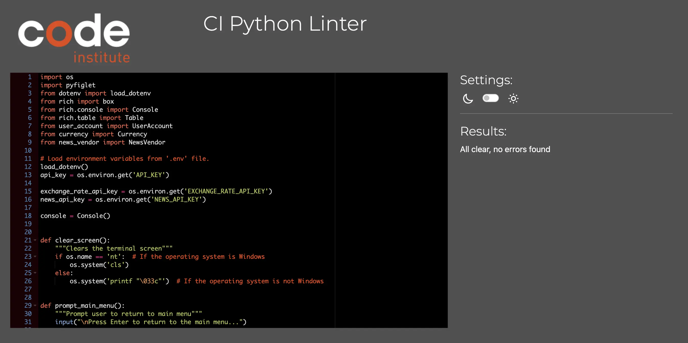

#### user_account.py results

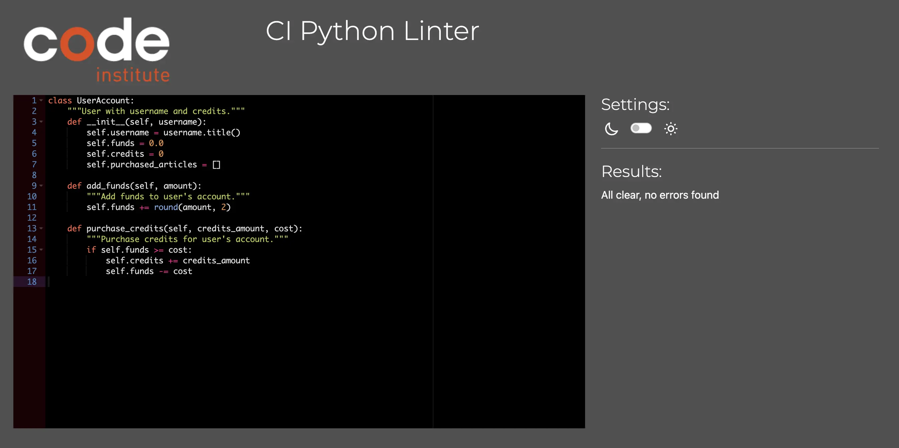

#### news_vendor.py results

#### currency.py results

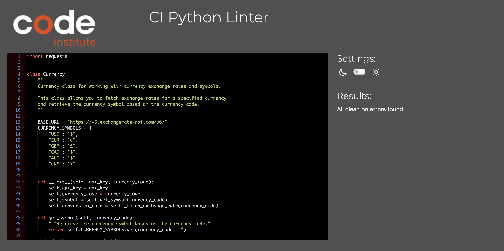

## Manual testing

#### User Stories Testing

`User Goals`
| User Goals | How are they achieved? |
| :----------------------------------------------------------------------------------------------------------------------------------------------------- | :---------------------------------------------------------------------------------------------------------------------------------------------------------------------------------------------------------------- |
| 1. As a user, I want to sign into the application using my unique username for personalized access. | Implemented a prompt on opening the application that asks the user for their name and validates for correct input. |
| 2. As a user, I wish to purchase app credits in various major currencies, ensuring more international accessibility. | Added a feature to select a currency upon application start, with validation for correct input among various currency options. |
| 3. As a user, I want a main menu displaying the available tasks within the app for easy navigation. | Added a main menu with corresponding numbered options, displayed in a clear and readable table layout. |
| 4. As a user, I want to view my account balance, credits, and purchased articles to understand my current status and resources. | The user's account information, such as credits and funds, is shown on the main menu screen and within the appropriate submenus to keep them informed about their account status. |
| 5. As a user, I wish to easily top up my account funds using my preferred currency. | Users have the option from the main menu to add funds to their account by selecting option 1, where they can enter the amount they wish to add in their previously chosen currency. |
| 6. As a user, I want to understand the value of in-store credits in relation to my chosen currency and decide how many credits to add. | When users choose to purchase credits (option 2), they will see a table showing available credit packages, each with its value calculated relative to their chosen currency. |
| 7. As a user, I'm interested in selecting news categories based on my preferences. | Users can filter news articles by choosing from a variety of categories such as sports, business, technology, etc. |
| 8. As a user, I want to receive notifications about special discounts available on any given day to maximize benefits. | When a user wishes to purchase articles, they will be notified next to the appropriate category if there is a sale on articles in that group. |
| 9. As a user, I want a dedicated space to store and retrieve information on the articles I've purchased, ensuring easy access. | Users can view their previously purchased articles by selecting option 4 from the main menu. Here they can see the headline, brief description, and are presented with the corresponding access link for each article. |
| 10. As a user, I want a straightforward option to exit and close the application once I'm done. | By selecting option 5 from the main menu, users can gracefully close the application and be greeted with a farewell splash screen. |

---

 

#### Feature Testing

 

`Terminal`
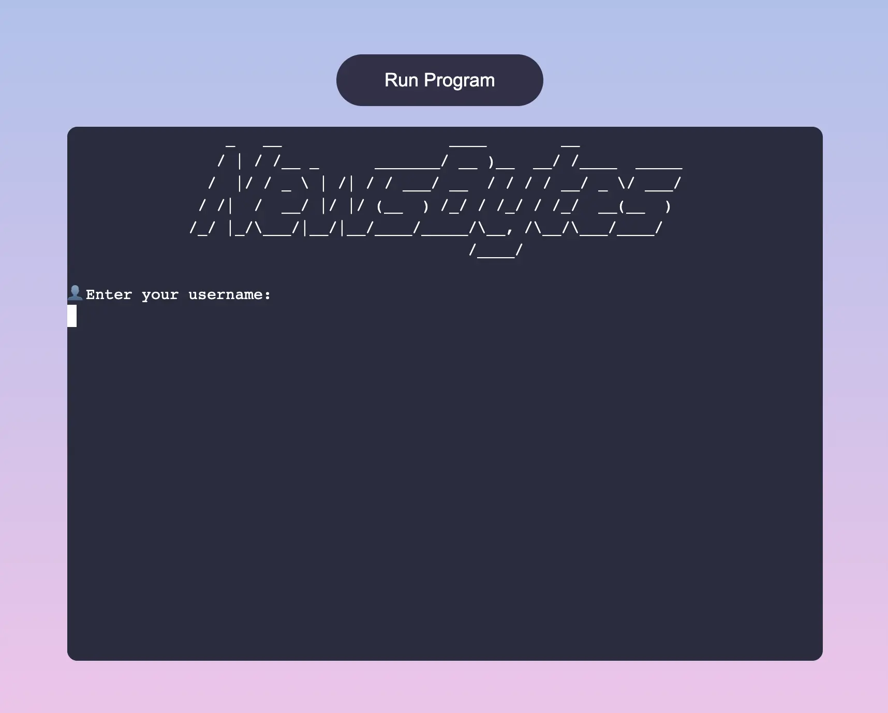
| Feature | Expected Outcome | Testing Performed | Result | Pass/Fail |
| -------- | -------------------------------------------- | ----------------- | -------------------------------------------------------------- | --------- |
| Terminal | Terminal is displayed upon website load | Load web app | Terminal is shown to the user when the website loads | Pass ✅ |
| Terminal | Loads Python script and waits for user input | Load web app | Python script is correctly loaded and awaits user input | Pass ✅ |
| Terminal | Is positioned in the center of the viewport | Load web app | Terminal is correctly positioned in the center of the viewport | Pass ✅ |
| Logo | Renders the splash screen logo | Load web app | Logo is correctly displayed when the app starts | Pass ✅ |

 

`Run Program Button`

### 

| Feature            | Expected Outcome                                     | Testing Performed | Result                                             | Pass/Fail |
| ------------------ | ---------------------------------------------------- | ----------------- | -------------------------------------------------- | --------- |
| Run Program Button | Button is visible on website load                    | Load web app      | Button loads correctly                             | Pass ✅   |
| Run Program Button | Button is centered and positioned above the terminal | Load web app      | Button is correctly positioned                     | Pass ✅   |
| Run Program Button | Lightens on hover                                    | Hover over button | Button background color changes to a lighter shade | Pass ✅   |
| Run Program Button | Restarts program when clicked                        | Click button      | Program successfully restarts                      | Pass ✅   |

 

`Username Input`

| Feature | Expected Outcome | Testing Performed | Result | Pass/Fail |
| ----------------------- | -------------------------------------------------------------------- | ----------------- | --------------------------- | --------- |
| Username Input | User enters a valid name | Enter a valid name | Input accepted and code resumes execution | Pass ✅ |
| Username Input | User enters a valid full name (including spaces) | Enter a valid full name | Input accepted and code resumes execution | Pass ✅ |
| Username Input | User is reprompted with an instructive message if input is empty | Enter an empty value | User is reprompted with an appropriate instructive message | Pass ✅ |
| Username Input | User is reprompted with an instructive message if input contains numbers or special characters | Enter numbers or special characters | User is reprompted with an appropriate instructive message | Pass ✅ |

 

`Currency Input`

| Feature | Expected Outcome | Testing Performed | Result | Pass/Fail |
| ----------------------- | -------------------------------------------------------------------- | ----------------- | --------------------------- | --------- |
| Currency Input | User enters a valid currency in either upper or lower case | Enter a valid currency | Input accepted and code resumes execution | Pass ✅ |
| Currency Input | User is reprompted with an instructive message if input is empty | Enter an empty value | User is reprompted with an appropriate instructive message | Pass ✅ |
| Currency Input | User is reprompted with an instructive message if input does not match any from the list of currency codes | Enter invalid currency code | User is reprompted with an appropriate instructive message | Pass ✅ |
| Currency Input | User is reprompted with an instructive message if input contains numbers or special characters | Enter numbers or special characters | User is reprompted with an appropriate instructive message | Pass ✅ |

 

`Main Menu Section`
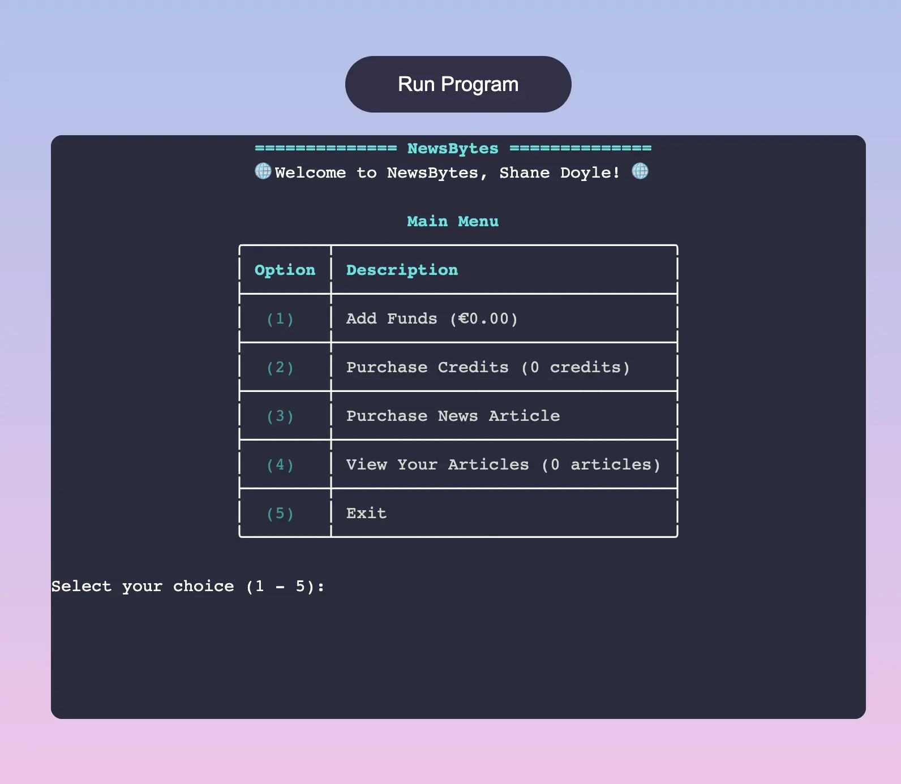
| Feature | Expected Outcome | Testing Performed | Result | Pass/Fail |
| ----------------- | ----------------------------------------------------------- | ----------------------- | ------------------------------------- | --------- |
| Main Menu | Main menu is displayed after user enters their chosen currency | Enter chosen currency | Main menu is displayed | Pass ✅ |
| Greeting Message | Greeting message displays user's name | Access menu | Username is shown in the header | Pass ✅ |
| Main Menu | Menu is rendered in a table layout | Access menu | Menu is rendered in table layout | Pass ✅ |
| Main Menu | Table headers are rendered in cyan | Access menu | Table headers are shown in the expected color | Pass ✅ |
| Main Menu Input | User is reprompted if input is empty | Enter empty value | User is reprompted | Pass ✅ |
| Main Menu Input | User is reprompted if input is not in range (1 - 5) | Enter invalid input | User is reprompted | Pass ✅ |
| Add Funds | User's account funds are displayed next to the description | Access menu | Correct amount is displayed | Pass ✅ |
| Add Funds | User enters the add funds section by pressing the 1 key | Press 1 key | User is taken to the add funds section | Pass ✅ |
| Purchase Credits | User's account credits are displayed next to the description | Access menu | Correct amount is displayed | Pass ✅ |
| Purchase Credits | User enters the purchase credits section by pressing the 2 key | Press 2 key | User is taken to the purchase credits section | Pass ✅ |
| Purchase Articles Option | User enters the purchase articles section by pressing the 3 key | Press 3 key | User is taken to the purchase articles section | Pass ✅ |
| View Articles | User enters the purchased articles section by pressing the 4 key | Press 4 key | User is taken to the purchased articles section | Pass ✅ |
| View Articles | Number of user's articles shown in description | Access menu | Correct number of user's articles displayed | Pass ✅ |
| Exit Option | User can gracefully exit the program by pressing the 5 key | Press 5 key | Program is closed and farewell splash screen is shown | Pass ✅ |

 

`Add Funds Section`
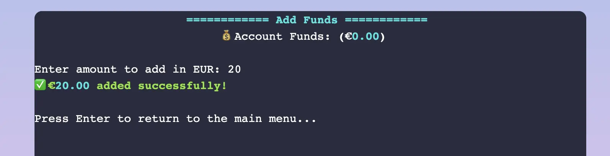
| Feature | Expected Outcome | Testing Performed | Result | Pass/Fail |
| --------------- | ---------------------------------------------- | ---------------------------------- | ------------------------------------ | --------- |
| Add Funds Section | Add Funds Section is shown to the user upon pressing the 1 key | Press 1 key | Add funds section is displayed | Pass ✅ |
| Add Funds Section Header | User's account funds are displayed in the header | Select add funds option | User's account funds are shown | Pass ✅ |
| Add Funds Section Input | User's chosen currency is displayed in the input prompt message | Enter add funds section | User's chosen currency is shown in the input prompt | Pass ✅ |
| Add Funds Section Input | User enters a valid positive integer | Enter a valid amount | Success message showing amount added is displayed | Pass ✅ |
| Add Funds Section Input | User enters an invalid negative integer and should see a warning message | Enter a negative amount | Correct warning message is shown and user is reprompted | Pass ✅ |
| Add Funds Section Input | User enters letters or other special characters and should see a warning message | Enter letters or special characters | Correct warning message is shown and user is reprompted | Pass ✅ |
| Add Funds Section Input | User can return to the main menu by pressing any key | Press any key | User returns to the main menu | Pass ✅ |

 

`Purchase Credits Section`
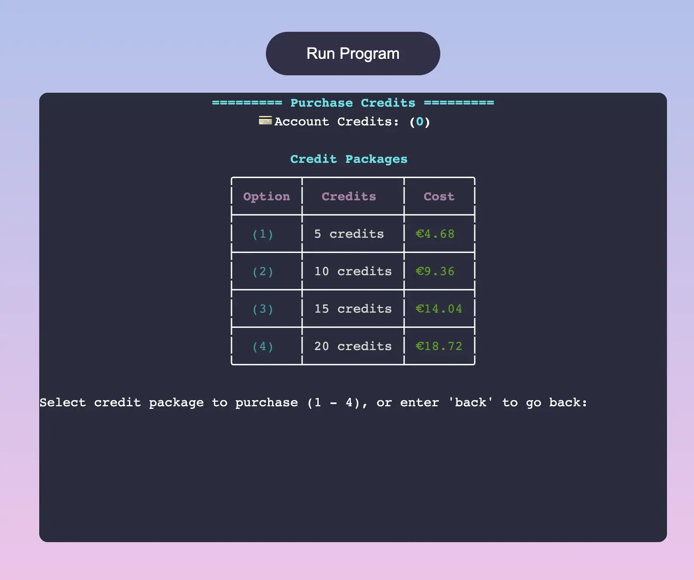
| Feature | Expected Outcome | Testing Performed | Result | Pass/Fail |
| --------------- | ------------------------------------------------------------ | ---------------------------------- | --------------------------------------- | --------- |
| Grid Tile | Back face image loads correctly | Start game | All back face images load correctly | Pass ✅ |

 

`Purchase News Articles Section`
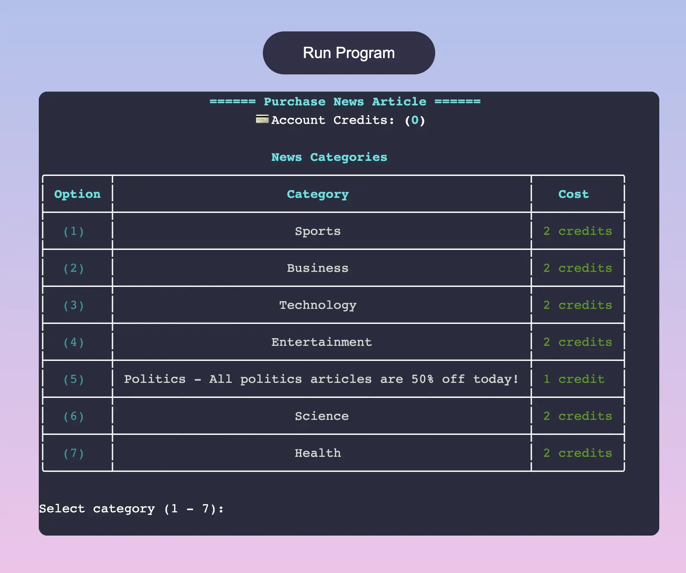
| Feature | Expected Outcome | Testing Performed | Result | Pass/Fail |
|------------|------------------------------------------------------------------------------|-------------------------|-----------------------------------------------------------------|-----------|
| Game Grid | 16 grid tiles are generated and appended to the game board when the game starts | Start game | All 16 grid tiles load correctly | Pass ✅ |

 

`User Articles Section`

| Victory Screen | Expected Outcome | Testing Performed | Result | Pass/Fail |
| -------------------- | ------------------------------------------------------------------------- | --------------------- | ----------------------------------------- | --------- |
| Victory Screen | Victory Screen displays when player matches all cards within time limit | Win the game | Victory Screen is displayed correctly | Pass ✅ |

 

`Exit Section`
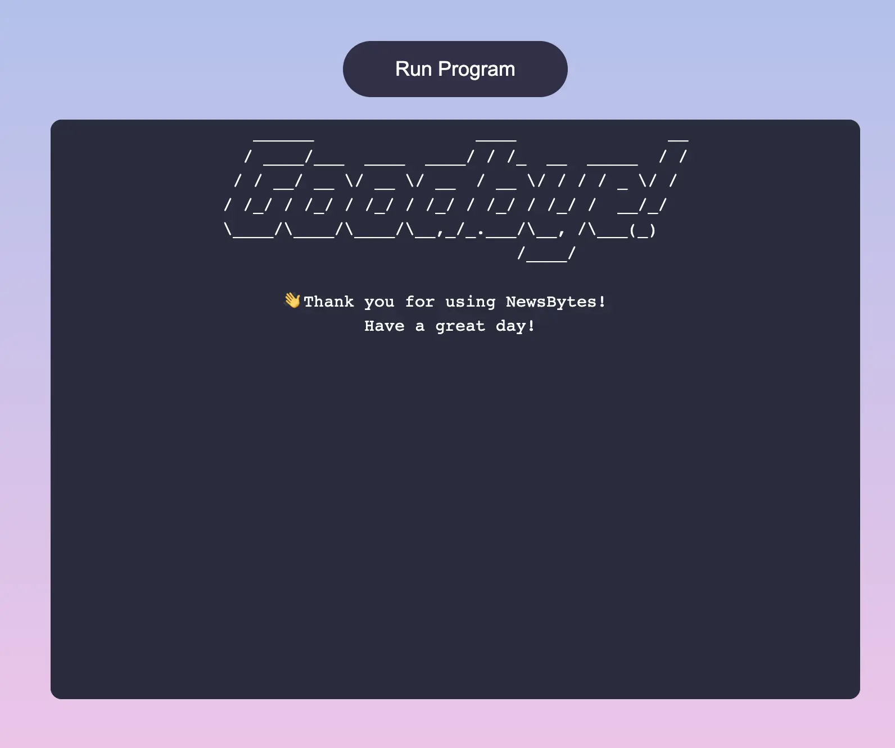
| Feature | Expected Outcome | Testing Performed | Result | Pass/Fail |
| ------------ | ------------------------------------------------------------------------ | ----------------- | ------------------------------------------------------------------------------------- | --------- |
| Exit Section | Exit splash screen is shown when the 5 key is pressed from the main menu | Press the 5 key | Exit splash screen is displayed correctly | Pass ✅ |
| Exit Section | Program finishes executing | Press the 5 key | Script has finished and user must restart the application with the Run Program button | Pass ✅ |

## Bugs

### Solved Bugs

#### 1. **Terminal not clearing all content above scroll (Solved)**

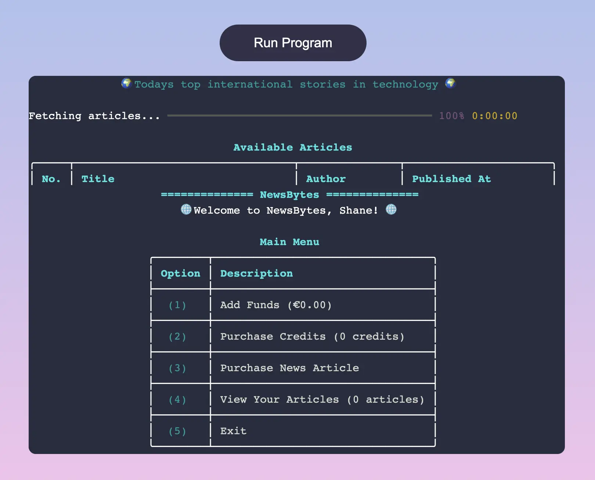

 

 

Initially, while attempting to clear the terminal screen, I observed that content beyond the scrolling bounds persisted. Further investigation revealed that this was a consequence of using the standard clear terminal command. To address this, I discovered that passing the `\033c` escape sequence into the `os.system()` method was a more effective solution. This approach, though lower-level, successfully ensured the complete clearance of the terminal screen.

 

#### 2. **Duplicate entry for promotional news category (Solved)**

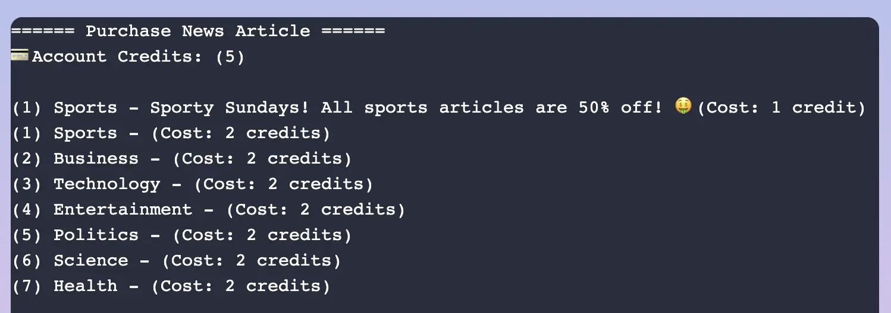

 

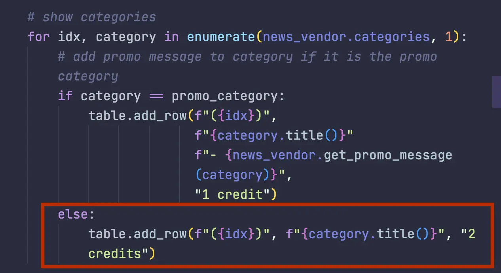

 

Initially, when looping through and displaying the news categories, I found that the promotional category of the day was being printed twice. To rectify this, I adjusted the conditional 'if' statement within the loop, incorporating an 'else' statement. This modification ensured that the promotional category would only be printed once per loop iteration.

 

#### 3. **Unreadable URL in articles section (Solved)**

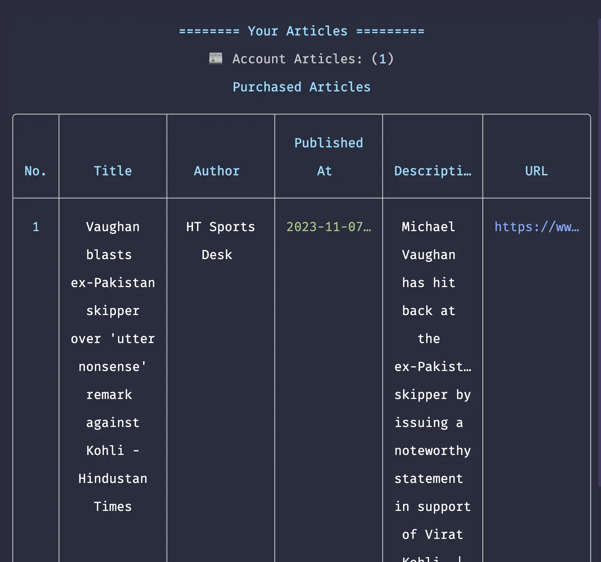

 

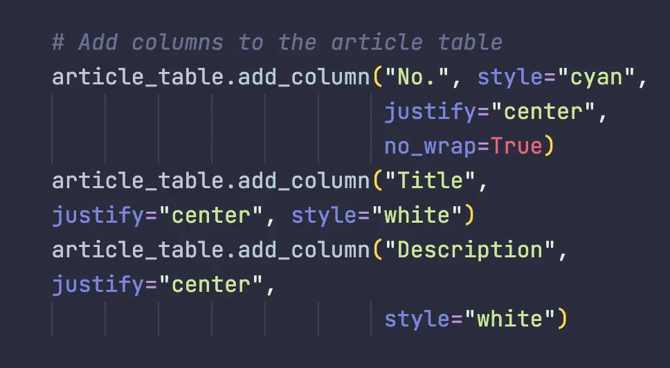

 

When displaying article information, I observed that the URL link for each article was truncated, which posed a user experience issue as users could not view the full link needed to access the articles. This truncation occurred because the table rendered by Rich struggled to fit all content within the terminal's constraints.

 

 

To resolve this, I streamlined the table by reducing the number of columns, focusing only on essential information for each article. This approach effectively saved screen space. Additionally, I displayed the access links separately, below the table, and highlighted them in cyan for clear visibility to the users. This adjustment not only addressed the space constraint issue but also improved the overall user experience by making the links easily accessible.

 

[Back to Top ^](#newsbytes---testing-documentation)
